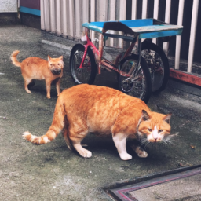
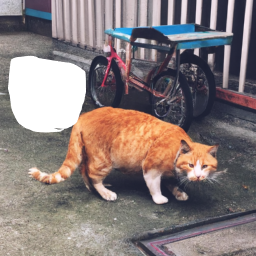

# ImageGenAPI
DALL-E2 etc...

# DALL-E2
## Abstract
DALL-E2については以下の機能があります。
- 画像生成 (openai.Image.create)  
テキストから画像を生成する。
- 画像編集 (openai.Image.create_edit)  
元の画像に加えて、変更したい部分を透過した画像(マスク画像)を準備し、テキストベースで編集する。
- 画像バリエーション (openai.Image.create_variation)  
元の画像に似た画像を指定した枚数作成する。

## How to Use
1. スクリプトと同じディレクトリに`api_key.txt`を準備し、OpenAIから取得したAPIキーを記入する。
2. 必要なパッケージをインストールする。
```
pip install openai
```
3. 各処理に合わせたスクリプトを選択する。(ほぼ同じ処理のため、同一のフローとして説明する。)
- 画像生成 -> image_gen.py
- 画像編集 -> umage_edit.py
- 画像バリエーション -> image_variation.py
4. 画像サイズを選択する。対応サイズは以下の3種類。
- image_size_small -> 256x256
- image_size_midium -> 512x512
- image_size_large -> 1024x1024
5. 生成枚数を選択する。選択できる枚数は1～10枚です。
6. 選択した画像サイズ(デフォルトは`image_size_samll`)を変更したい場合は`access_openai`の第2引数を変更してください。  
生成枚数を変更したい場合は`gen_num`を変更してください。
7. スクリプトを実行すると、`result`フォルダに画像が保存されます。

## Pricing
| Resolution | Price |
|:--|--:|
|1024x1024|0.020 -USD/image|
|512x512|0.018 -USD/image|
|256x256|0.016 -USD/image|

## Examples
### 画像生成
```
街角を歩くかわいい犬と猫
```
  
犬と猫の指定であったが2匹の猫がうつる画像が出力された。  
プロンプトは英語で描いた方が精度が高いらしい(？)  
### mask画像
  
PowerPointを使って猫の左後ろを塗りつぶし。(結合機能)